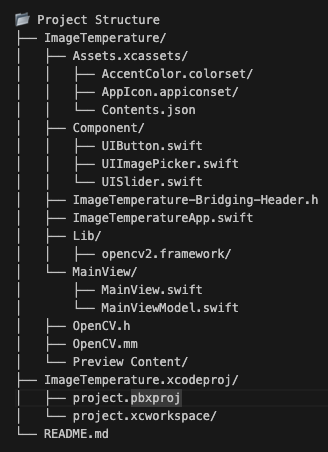

# 📸 SwiftUI + OpenCV: Real-Time Image Temperature Adjustment App  

This is an iOS application built with **SwiftUI** and **OpenCV** using the **MVVM architecture**. The app allows users to adjust the temperature of a **JPEG image** in real-time, leveraging OpenCV for image processing.  

## 🛠 Tech Stack
- **SwiftUI** – For building the user interface.
- **OpenCV** – For image processing.

## ✨ Features  
- 📸 **JPEG Image Support** – Only accepts JPEG images for processing.  
- 🎚 **Real-Time Temperature Adjustment** – Modify the image temperature dynamically using a slider.  
- 🖐 **Long Press Undo Feature** – Temporarily revert the image to its original state while holding a long press.  
- 🏗 **MVVM Architecture** – Ensures clean and maintainable code.  
- 🚀 **Swift-OpenCV Integration** – Uses Objective-C++ bridging to apply OpenCV processing within SwiftUI.  

## 📂 Project Structure  
The project follows the **MVVM (Model-View-ViewModel) architecture**, with clear separation between UI, business logic, and OpenCV processing.



## Installation

1. Clone the project from the repository:
   ```sh
   git clone https://github.com/freakandstein/swiftui-opencv.git
   ```
2. Note that the `Lib/opencv2.framework` is not pushed in the repository. You need to download it manually from the following link:
   [OpenCV iOS Framework 4.11.0](https://github.com/opencv/opencv/releases/download/4.11.0/opencv-4.11.0-ios-framework.zip)

3. Extract the downloaded zip file and move the `opencv2.framework` into the `Lib` folder of the project.

4. Open the project in Xcode and add the `opencv2.framework` to your project:
   - Go to your project settings.
   - Select your target.
   - Navigate to the "General" tab.
   - Scroll down to the "Frameworks, Libraries, and Embedded Content" section.
   - Click the "+" button and add the `opencv2.framework`.

5. Build and run the project.